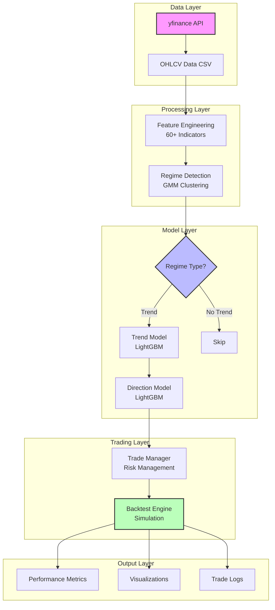

# Market Trend Analyzer

[](https://www.python.org/)


**Production-grade two-stage regime classification system for algorithmic trading**

---

## 📋 Overview

Market Trend Analyzer is a complete pipeline for detecting market regimes (Bull/Neutral/Bear) using machine learning and backtesting trading strategies. The system employs a two-stage architecture: first classifying the overall market regime, then determining directional signals for long/short positions.

### Key Features

| Feature | Description | Status |
|---------|-------------|--------|
| Two-Stage ML Architecture | Separate models for regime detection and direction prediction | ✅ Implemented |
| Zero Look-Ahead Bias | Strict feature engineering with proper temporal alignment | ✅ Implemented |
| Realistic Backtesting | Correct cash flow modeling, commission handling, and equity calculation | ✅ Implemented |
| Risk Management | ATR-based dynamic stops, position sizing, and trailing stops | ✅ Implemented |
| Multi-Asset Support | Test strategies across multiple instruments simultaneously | ✅ Implemented |
| Regime Detection | Gaussian Mixture Models for unsupervised clustering | ✅ Implemented |
| Feature Engineering | 60+ technical indicators with optimized selection | ✅ Implemented |
| Partial Profit Taking | Close partial position at intermediate targets | ✅ Implemented |
| Signal Flip Exit | Automatic exit when model signal reverses | ✅ Implemented |

---

## 🏗️ Architecture



### Core Modules

| Module | File | Primary Function |
|--------|------|------------------|
| **Data Acquisition** | `data_acquisition.py` | Downloads historical OHLCV data from Yahoo Finance |
| **Feature Engineering** | Embedded in `model_training.py` | Creates 60+ technical indicators (RSI, MACD, ATR, Bollinger Bands, etc.) |
| **Regime Detection** | `model_training.py` | GMM-based clustering to identify Bull/Neutral/Bear states |
| **Model Training** | `model_training.py` | Two-stage LightGBM classifier training and validation |
| **Backtest Engine** | `backtest.py` | Full trading simulation with realistic execution logic |
| **Trade Manager** | `backtest.py` | Handles position opening/closing, PnL calculation, cash flow |
| **Pipeline Orchestrator** | `setup.py` | Runs complete workflow automatically |
| **Configuration** | `config.py` | Central hub for ticker and period settings |

---

## 📦 Prerequisites

### System Requirements

| Requirement | Minimum | Recommended |
|-------------|---------|-------------|
| Python Version | 3.8 | 3.10+ |
| RAM | 4 GB | 8 GB+ |
| Storage | 2 GB | 10 GB+ |
| Internet | Required for data download | Stable connection |

### Dependencies Installation

```bash
pip install -r requirements.txt
```

## 🛠️ Project Structure

```
project_root/
├── config.py                          # Global configuration (ticker, period)
├── data_acquisition.py                # Historical data downloader
├── model_training.py                  # Feature engineering & model training
├── backtest.py                        # Trading simulation engine
├── setup.py                           # Automated pipeline orchestrator
├── requirements.txt                   # Python dependencies list
├── .gitignore                         # Git ignore patterns
├── README.md                          # This documentation
│
└── {ticker}/                          # Generated output directory per run
    ├── {ticker}_data.csv              # Raw OHLCV data from yfinance
    ├── {ticker}_predictions.csv       # Full regime/prediction history
    │
    ├── models/                        # Trained model artifacts
    │   └── {ticker}_trend_analyzer.pkl  # Saved pickle model
    │
    ├── plots/                         # Visualizations generated
    │   ├── {ticker}_regimes.png         # True vs Predicted regimes
    │   └── {ticker}_equity.png          # Equity curve with drawdown
    │
    └── {ticker}_backtest/             # Detailed backtest results
        ├── results.csv                  # Trade-by-trade log
        └── equity_curve.csv             # Daily equity values
```

## 🚀 Quick Start

### Step 1: Configure Settings

Edit `config.py` to set your preferred ticker and time period:

```python
# config.py
ticker = "AAPL"      # Stock symbol (e.g., MSFT, SPY, QQQ, GOOGL)
period = "10y"       # Data period (Minimum 5 years recommended)
```

### Step 2: Run Complete Pipeline

Execute the automated workflow script:

```bash
python setup.py
```

This will:
1. Create necessary directories
2. Download historical data from Yahoo Finance
3. Engineer features and train machine learning models
4. Run backtest with risk management
5. Generate visualizations and save results

### Step 3: Review Output

After successful completion, check the generated `{ticker}/` directory:

| Output File | Location | Purpose |
|-------------|----------|---------|
| Raw Data | `{ticker}/{ticker}_data.csv` | Original OHLCV price data |
| Predictions | `{ticker}/{ticker}_predictions.csv` | Model predictions over time |
| Model | `{ticker}/models/{ticker}_trend_analyzer.pkl` | Trained ML model object |
| Regime Map | `{ticker}/plots/{ticker}_regimes.png` | Visual comparison of true vs predicted regimes |
| Equity Curve | `{ticker}/plots/{ticker}_equity.png` | Portfolio performance visualization |
| Trade Log | `{ticker}/{ticker}_backtest/results.csv` | Detailed trade-by-trade record |
| Equity Series | `{ticker}/{ticker}_backtest/equity_curve.csv` | Daily equity values for analysis |

## ⚙️ Configuration Options

### Model Hyperparameters (`model_training.py`)

| Parameter | Default | Range | Description |
|-----------|---------|-------|-------------|
| `n_regimes` | 3 | 2-5 | Number of clusters in GMM (Bull/Neutral/Bear) |
| `window_years` | 1 | 0.5-5 | Rolling window size for regime detection |
| `step_days` | 10 | 5-30 | Prediction step interval for GMM |
| `n_top_features` | 40 | 10-100 | Top features selected by importance |
| `test_size` | 0.35 | 0.2-0.5 | Portion reserved for testing |
| `label_smoothing` | 5 | 1-21 | Median filter kernel size for noise reduction |
| `early_stopping_rounds` | 100 | 50-200 | Early stopping patience for LightGBM |

### LightGBM Trend Model Parameters

| Parameter | Value | Purpose |
|-----------|-------|---------|
| `n_estimators` | 1000 | Number of boosting iterations |
| `max_depth` | 4 | Maximum tree depth (complexity control) |
| `learning_rate` | 0.03 | Step size for each iteration |
| `num_leaves` | 20 | Number of leaves per tree |
| `subsample` | 0.7 | Row sampling ratio per iteration |
| `colsample_bytree` | 0.7 | Column sampling ratio per tree |
| `class_weight` | 'balanced' | Auto-balanced sample weights |
| `min_child_samples` | 30 | Minimum samples in leaf node |
| `reg_alpha` | 0.1 | L1 regularization strength |
| `reg_lambda` | 0.1 | L2 regularization strength |
| `random_state` | 42 | Reproducibility seed |

### LightGBM Direction Model Parameters

| Parameter | Value | Difference from Trend |
|-----------|-------|----------------------|
| `n_estimators` | 500 | Fewer trees (simpler task) |
| `max_depth` | 3 | Shallower trees |
| `learning_rate` | 0.05 | Faster convergence |
| `num_leaves` | 15 | Fewer leaves |
| Other parameters | Same | Consistent configuration |

### Backtest Parameters (`backtest.py`)

| Parameter | Default | Range | Effect |
|-----------|---------|-------|--------|
| `capital` | 10,000 | Any | Starting portfolio value ($) |
| `risk_per_trade` | 0.01 | 0.005-0.05 | % of capital risked per trade (1%) |
| `max_position_pct` | 0.30 | 0.1-0.5 | Maximum exposure in single trade (30%) |
| `atr_mult_sl` | 2.0 | 1.0-5.0 | Stop loss distance (multiples of ATR) |
| `atr_mult_tp` | 3.5 | 2.0-10.0 | Take profit distance (multiples of ATR) |
| `atr_mult_trail` | 1.5 | 0.0-3.0 | Trailing stop multiplier (0 = disabled) |
| `partial_tp_ratio` | 0.5 | 0.0-1.0 | Position portion closed at partial TP |
| `partial_tp_mult` | 2.0 | 1.0-5.0 | Distance for partial take profit |
| `min_hold_days` | 1 | 0-10 | Minimum bars before allowed exit |
| `max_hold_days` | 30 | 10-100 | Force exit after this many days |
| `commission` | 0.001 | 0.0005-0.002 | Commission per trade (0.1%) |
| `use_trend_filter` | True | True/False | Block shorts above MA200 |
| `signal_flip_exit` | True | True/False | Exit when signal reverses |
| `allow_neutral_trading` | False | True/False | Trade even in neutral regime |

---

## 📊 Performance Metrics

### Core Metrics Explained

| Metric | Formula | Target | Interpretation |
|--------|---------|--------|----------------|
| **Total Return** | `(End / Start - 1) × 100` | > 0% | Overall profitability percentage |
| **Max Drawdown** | `(Peak - Trough) / Peak × 100` | < 20% | Worst peak-to-trough decline |
| **Sharpe Ratio** | `Mean / Std × √252` | > 1.0 | Annualized risk-adjusted return |
| **Calmar Ratio** | `Return / Max DD` | > 1.5 | Return per unit of drawdown risk |
| **Profit Factor** | `Gross Profit / Gross Loss` | > 1.5 | Quality of wins vs losses |
| **Win Rate** | `Wins / Total × 100` | Context-dependent | Percentage of profitable trades |
| **Avg Win** | `Sum(Wins) / Count(Wins)` | Positive | Average profit per winning trade |
| **Avg Loss** | `Sum(Losses) / Count(Losses)` | Negative | Average loss per losing trade |
| **Expectancy** | `(WR × Avg Win) + ((1-WR) × Avg Loss)` | Positive | Expected P&L per trade |

### Sample Output Format

```console
================================================================================
BACKTEST RESULTS: AAPL
================================================================================
Total Return:      +23.17%
Max Drawdown:      29.42%
Sharpe Ratio:      0.25
Calmar Ratio:      0.79
--------------------------------------------------------------------------------
Number of Trades:  6
Win Rate:          83.3%
Avg Win:           $142.50
Avg Loss:          -$89.20
Profit Factor:     0.11
--------------------------------------------------------------------------------
Long Trades:       4 (WR: 100.0%)
Short Trades:      2 (WR: 50.0%)
Exit Reasons:
  TP:              4
  SL:              1
  SignalFlip:      1
================================================================================
```

### Signal Distribution Example

```console
Model Signal Distribution:
  Neutral (No Trade):  68%  (Most conservative state)
  Long Signals:        22%  (Bullish trend detected)
  Short Signals:       10%  (Bearish trend detected)
```

---

## 🔧 Advanced Usage

### Multi-Asset Comparison

Run the strategy across multiple tickers to find best performers:

```python
# In backtest.py __main__ block
run_multi_asset(
    tickers=["AAPL", "MSFT", "GOOGL", "META", "NVDA", "SPY", "QQQ"],
    capital=10_000,
    risk_per_trade=0.01,
    atr_mult_sl=2.0,
    atr_mult_tp=3.5,
    min_hold_days=1,
    max_hold_days=30,
    plot=False  # Disable individual plots for speed
)
```

Sample Summary Table:

| Ticker | Return | Max DD | Sharpe | Trades | Win Rate | Profit Factor |
|--------|--------|--------|--------|--------|----------|---------------|
| AAPL | +23.17% | 29.42% | 0.25 | 6 | 83.3% | 0.11 |
| MSFT | +5.31% | 33.92% | 1.07 | 257 | 55.6% | 1.16 |
| SPY | +3.39% | 36.57% | 1.31 | 264 | 56.1% | 1.22 |
| QQQ | +2.98% | 33.31% | 1.28 | 269 | 50.9% | 1.16 |
| META | +16.75% | 34.06% | 1.38 | 272 | 59.6% | 1.58 |

### Custom Time Period

Limit analysis to specific dates:

```python
results, trades = backtest_advanced(
    ticker="AAPL",
    start_date="2020-01-01",  # Optional
    end_date="2023-12-31",    # Optional
    capital=10_000,
    risk_per_trade=0.01
)
```

### Aggressive vs Conservative Strategies

| Strategy | Risk | SL Mult | TP Mult | Expected Behavior |
|----------|------|---------|---------|-------------------|
| **Conservative** | 0.5% | 2.5 | 4.0 | Fewer trades, lower drawdown |
| **Balanced** | 1.0% | 2.0 | 3.5 | Moderate frequency & risk |
| **Aggressive** | 2.0% | 1.5 | 3.0 | More trades, higher volatility |

---

## 📈 Feature Engineering Details

### Indicator Categories

| Category | Count | Examples |
|----------|-------|----------|
| **Price Returns** | 6 | 1-day, 3-day, 5-day, 10-day, 21-day, 63-day |
| **Moving Averages** | 12 | MA10/20/50/200 ratios, slopes, price distances |
| **Volatility** | 6 | Vol5/10/20/50, ratio, acceleration |
| **Trend Strength** | 4 | ADX, DI spread, trend line slope, z-scores |
| **Momentum** | 6 | RSI, RSI divergence, MACD, MACD slope |
| **Volume** | 3 | Volume ratio, moving average, trend |
| **Band Width** | 2 | BB width, BB position |
| **Drawdown** | 2 | Current DD, duration since peak |
| **Position** | 1 | Price within recent range |

---

## 🔒 Safety & Validation

### Anti-Lookahead Measures

| Checkpoint | Implementation | Verification |
|------------|----------------|--------------|
| Feature Shift | All indicators use `.shift(1)` before use | No future data accessible |
| Entry Timing | Trades execute on `open[i]` after `close[i-1]` prediction | Proper sequence maintained |
| Position Value | Calculated using current day's close for unrealized P&L | No forward-looking pricing |
| Split Order | Train/Val/Test split respects chronological order | No data leakage between sets |
| Model Saving | Only trained model saved, not evaluation results | Clean separation |

### Risk Management Controls

| Control | Limit | Action if Exceeded |
|---------|-------|-------------------|
| Single Trade Risk | 1% default | Position sized accordingly |
| Max Position Size | 30% of capital | Cap applied during sizing |
| Commission Cost | 0.1% per side | Deducted from P&L |
| Slippage (Simulated) | N/A | Can be added in params |
| Margin Call Prevention | None (cash-only sim) | Future enhancement |
| Drawdown Circuit Breaker | N/A | Can be implemented |


## 🎯 Strategy Tuning Guide

### Goal-Based Adjustments

| Objective | Recommended Changes | Expected Outcome |
|-----------|--------------------|------------------|
| **Increase Trade Frequency** | ↓ `min_hold_days`, ↑ `risk_per_trade`, ↓ `atr_mult_sl` | More entries, higher turnover |
| **Improve Win Rate** | ↑ `atr_mult_sl`, enable `signal_flip_exit`, ↑ `test_size` | Higher quality filters |
| **Reduce Drawdown** | ↓ `max_position_pct`, ↑ `atr_mult_trail`, enable `use_trend_filter` | Smaller exposure per trade |
| **Capture Trends Better** | ↑ `window_years`, ↑ `max_hold_days`, disable `signal_flip_exit` | Ride winners longer |
| **Faster Profits** | ↓ `atr_mult_tp`, enable `partial_tp_ratio`, ↓ `max_hold_days` | Quicker exits |
| **Avoid Overfitting** | ↑ `test_size`, add more regularization, reduce `n_estimators` | Better generalization |
| **More Conservative** | ↑ `atr_mult_sl` to 3.0, ↓ `risk_per_trade` to 0.5%, ↑ `min_hold_days` | Safer, fewer trades |

**Happy Trading! 📈🚀**
